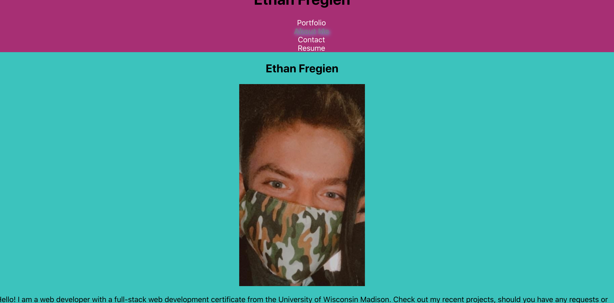

# React-portfolio

## Description 
Hello! This portfolio was created using React.js. It contains a bio about me as well as a portfolio that displays the projects I have completed with links to the deployed pages and repositories. This site also includes a contact section along with a resume section which lists my coding skills.

Link to deployed application: :link: https://mighty-shelf-85061.herokuapp.com/

## Screenshot

## Table of Contents
* [License](#license)
* [Questions](#questions)

## License
https://opensource.org/licenses/MIT

## Questions
Please reach out by email or GitHub with questions.

https://github.com/ethanfregien2233

ethanfregien@gmail.com
